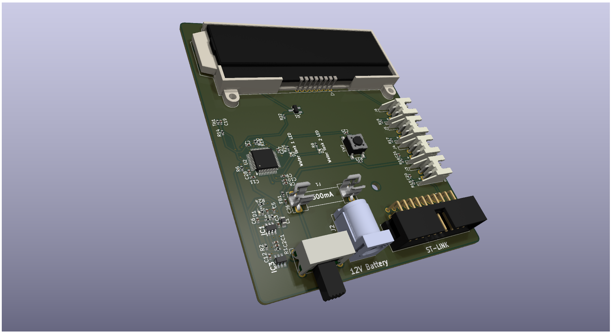

# Caravan-Monitor
For monitoring caravan stuff

This is an STM32 powered monitoring station for different kinds of sensors made with caravans in mind.
It is powered by 12v car batteries and it has an NTC for temperature measurement. All other sensors are off the board and connected with wires.

