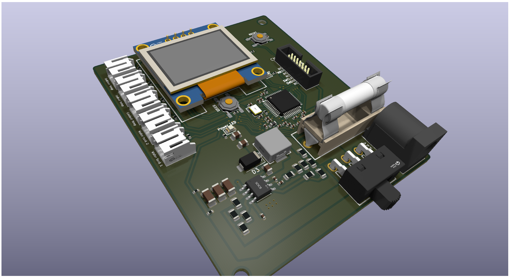

# Caravan-Monitor
For monitoring caravan stuff

This is an STM32 powered monitoring station for different kinds of sensors made with caravans in mind.
It is powered by 12v car batteries. All other are off the board and connected with wires.

It shows the values on a cheap 1²C OLED display and there is one button to browse the values.

